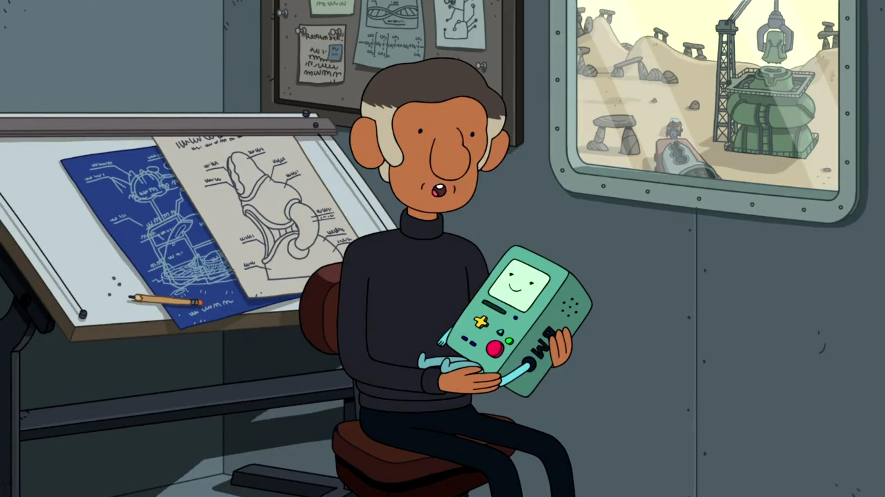

[](https://github.com/gongahkia/moe/releases/tag/1.0.0) 

# `Moe`

Discord bot that finds [Steam](https://store.steampowered.com/) games you can play with friends.

## Stack

* *Backend*: [Python](https://www.python.org/)
* *Package*: [Docker](https://www.docker.com/https://www.docker.com/)
* *Cache*: [Redis](https://redis.io/)
* *API*: [Discord Developer API](https://discord.com/developers/docs/reference), [Steam Web API](https://steamcommunity.com/dev)

## Commands

| Command | Description | Example |
| :--- | :--- | :---: |
| `` | |  |

## Usage

The below instructions are for locally hosting `Moe`.

1. Create a [Discord application](https://discord.com/developers/applications) and a bot for that application.
2. Enable the following permissions under *Priviledged Gateway Intents* in the Bot tab.
    1. Presence Intent
    2. Server Members Intent
    3. Message Content Intent
    4. Application Commands Intent
3. Enable the following permissions under *Bot Permissions* in the Bot tab.
    1. Send Messages
    2. View Channel
    3. Read Message History
    4. Use Slash Commands

4. Place your Discord bot token, Steam API key and Redis URL in a `.env` file within `./src/`.

```env
DISCORD_TOKEN=XXX
STEAM_API_KEY=XXX
REDIS_URL=redis://redis:6379/0
```

5. Run the following.

```console
$ sudo apt-get install redis-server
$ python3 -m venv myenv
$ source myenv source/bin/activate
$ pip install -r requirements.txt
$ make config
```

6. Then run either of the following.

```console
$ docker-compose build && docker-compose up
```

```console
$ make
```

## Screenshot

...

## Architecture

...

## Other notes

...

## Reference

The name `Moe` is in reference to [Moseph "Moe" Mastro Giovanni](https://adventuretime.fandom.com/wiki/Moev), the founder of [MO Co.](https://adventuretime.fandom.com/wiki/MO_Co.) and the creator of [BMO](https://adventuretime.fandom.com/wiki/BMO) and all other [MOs](https://adventuretime.fandom.com/wiki/MOshttps://adventuretime.fandom.com/wiki/MOs). Moe first makes an appearance in the [Be More](https://adventuretime.fandom.com/wiki/Be_Morehttps://adventuretime.fandom.com/wiki/Be_More) episode of the completed [Cartoon Network](https://en.wikipedia.org/wiki/Cartoon_Network) series [Adventure Time](https://adventuretime.fandom.com/wiki/Adventure_Time_Wikihttps://adventuretime.fandom.com/wiki/Adventure_Time_Wiki).


