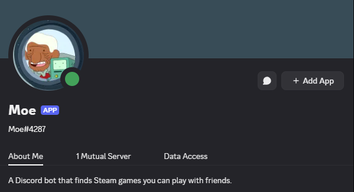
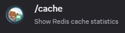
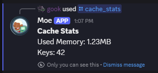
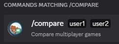
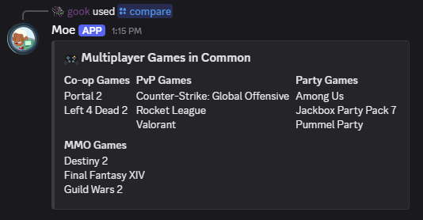
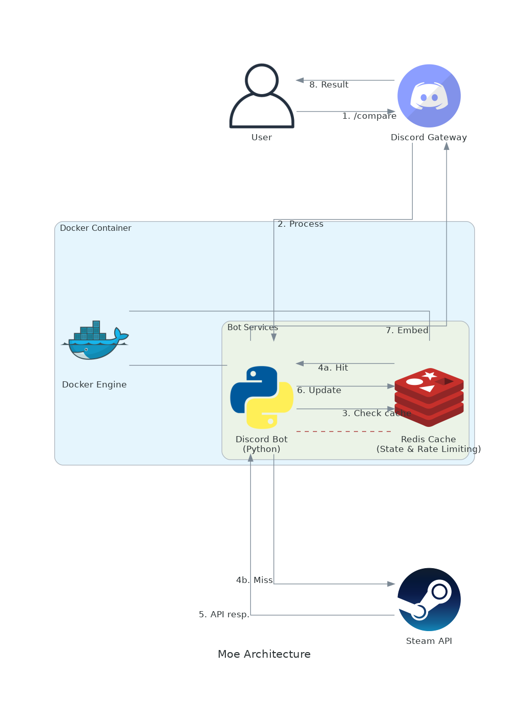

[](https://github.com/gongahkia/moe/releases/tag/1.0.0) 

# `Moe`

Discord bot that suggests Multiplayer [Steam](https://store.steampowered.com/) Games you can play with friends by comparing your [Steam Libraries](https://steam.fandom.com/wiki/Steam_Library) per [genre](https://store.steampowered.com/tag/browse/#global_492).

<div align="center">
    
</div>

## Stack

* *Backend*: [Python](https://www.python.org/)
* *Package*: [Docker](https://www.docker.com/)
* *Cache*: [Redis](https://redis.io/)
* *API*: [Discord Developer API](https://discord.com/developers/docs/reference), [Steam Web API](https://steamcommunity.com/dev)

## Commands

| Command | Description | Example |
| :--- | :--- | :---: |
| `/cache` | Show current Redis cache statistics |  <br> |
| `/compare <server_member_1> <server_member_2>` | Finds and categorizes shared multiplayer Steam games between two Discord server members |  <br>  |

## Architecture



## Usage

The below instructions are for locally hosting `Moe`.

1. Create a [Discord application](https://discord.com/developers/applications) and a bot for that application.
2. Enable the following permissions under *Priviledged Gateway Intents* in the Bot tab.
    1. Presence Intent
    2. Server Members Intent
    3. Message Content Intent
    4. Application Commands Intent
3. Enable the following permissions under *Bot Permissions* in the Bot tab.
    1. Send Messages
    2. View Channel
    3. Read Message History
    4. Use Slash Commands
4. Place your Discord bot token, Steam API key and Redis URL in a `.env` file within `./src/`.

```env
DISCORD_TOKEN=XXX
STEAM_API_KEY=XXX
REDIS_URL=redis://redis:6379/0
```

5. Run the following.

```console
$ python3 -m venv myenv
$ source myenv source/bin/activate
$ pip install -r requirements.txt
```

6. Then run either of the following.

```console
$ docker-compose build && docker-compose up
```

```console
$ make config
$ make
```

7. Note that it can take up to an hour to propogate `Moe`'s [Application Commands](https://discord.com/developers/docs/interactions/application-commands) with [Global Sync](https://stackoverflow.com/questions/76692316/how-to-sync-commands-globally-with-discord-py). 
8. To circumvent this issue, instantly sync `Moe`'s [Application Commands](https://discord.com/developers/docs/interactions/application-commands) by placing your Discord bot token, Discord Guild ID, Steam API key and Redis URL in a `.env` file within `./src/`.

```env
DISCORD_TOKEN=XXX
DISCORD_GUILD_ID=XXX
STEAM_API_KEY=XXX
REDIS_URL=redis://redis:6379/0
```

## Reference

The name `Moe` is in reference to [Moseph "Moe" Mastro Giovanni](https://adventuretime.fandom.com/wiki/Moev), the founder of [MO Co.](https://adventuretime.fandom.com/wiki/MO_Co.) and the creator of [BMO](https://adventuretime.fandom.com/wiki/BMO) and all other [MOs](https://adventuretime.fandom.com/wiki/MOshttps://adventuretime.fandom.com/wiki/MOs). Moe first makes an appearance in the [Be More](https://adventuretime.fandom.com/wiki/Be_Morehttps://adventuretime.fandom.com/wiki/Be_More) episode of the completed [Cartoon Network](https://en.wikipedia.org/wiki/Cartoon_Network) series [Adventure Time](https://adventuretime.fandom.com/wiki/Adventure_Time_Wikihttps://adventuretime.fandom.com/wiki/Adventure_Time_Wiki).


## Ideas to implement

### Vision 2.0: "Your Discord Server's AI Gaming Companion"

Transform Moe from a simple game comparison tool into an intelligent gaming hub that doesn't just find games you both own—but understands play styles, schedules game nights, tracks community trends, and turns your Discord server into an active gaming community.

### 🎯 Enhanced Value Proposition

**Problem**: Gamers have hundreds of games in their libraries but struggle to coordinate with friends about what to play together.

**Solution**: Moe becomes your server's gaming concierge—discovering shared games, suggesting optimal matches, tracking deals, scheduling sessions, and providing insights about your community's gaming habits.

**Unique Differentiators**:
- 🤖 AI-powered recommendations based on playtime, preferences, and mood
- 📅 Smart scheduling that considers everyone's availability
- 💰 Real-time price tracking and deal notifications
- 📊 Rich analytics and community insights
- 🎮 Seamless Discord integration (voice channels, events, rich embeds)

---

## 📋 Planned Features

### 🔴 TIER 1: Core Functionality (Essential)

#### 1. User Registration System ⭐⭐⭐
**Status**: Planned
**Priority**: P0 (Critical)

Allow users to link their Discord accounts to Steam profiles for seamless game comparisons.

**Commands**:
- `/register <steam_id>` - Link your Discord account to Steam
- `/unregister` - Unlink your Steam account
- `/profile [@user]` - View a user's linked Steam profile and gaming stats

**Technical Details**:
- Persistent storage (SQLite/PostgreSQL) for user mappings
- Auto-validation of Steam IDs via Steam API
- Privacy controls (public/private profile settings)
- Support for Steam vanity URLs

**Why It Matters**: Currently, the `/compare` command is non-functional because there's no way to map Discord users to Steam IDs. This is foundational for all other features.

---

#### 2. Fixed Game Comparison ⭐⭐⭐
**Status**: Bug Fix Required
**Priority**: P0 (Critical)

Fix the broken `/compare` command and enhance it with proper error handling.

**Improvements**:
- Fetch Steam IDs from registration database instead of non-existent `user.steam_id` attribute
- Handle edge cases: private profiles, users without games, unregistered users
- Better error messages with actionable feedback
- Support for pagination when showing 100+ shared games

**Current Bug**: `src/main.py:32-33` attempts to access `user.steam_id` which doesn't exist on Discord Member objects.

---

#### 3. Genre & Category Filtering ⭐⭐⭐
**Status**: Planned
**Priority**: P1

Implement the genre filtering functionality mentioned in the project description.

**Commands**:
- `/compare @user1 @user2 genre:fps` - Filter by specific genre
- `/compare @user1 @user2 type:coop` - Filter by game type (co-op, multiplayer, competitive)
- `/categories` - List all available genres and categories

**Technical Details**:
- Integrate Steam Store API for genre metadata
- Cache genre data per game (rarely changes)
- Support multiple genre filters: `genre:fps,rpg`
- Categorize by: Action, RPG, Strategy, FPS, Puzzle, Indie, etc.

**Enhanced Logic**:
```
Co-op Games (PvE together)
Competitive Games (PvP against each other)
Multiplayer Games (any online mode)
Local Co-op (same screen/couch gaming)
```

---

#### 4. Multi-Player Group Comparison ⭐⭐
**Status**: Planned
**Priority**: P2

Extend comparison from 2 players to groups of 3-10 players.

**Commands**:
- `/compare_group @user1 @user2 @user3 ...` - Find games everyone in the group owns
- `/compare_any @user1 @user2 @user3` - Show games at least 2 people own (subset matching)

**Visual Enhancements**:
- Venn diagram representation of game overlap
- "Core games" (everyone has) vs "Optional games" (some have)
- Suggested subgroups: "If 3 of you want to play, try these games"

---

### 🔥 TIER 2: Innovative Features (Hackathon-Worthy)

#### 5. AI-Powered Game Recommendations 🤖 ⭐⭐⭐
**Status**: Planned
**Priority**: P1
**Wow Factor**: ⭐⭐⭐⭐⭐

Integrate large language models (GPT-4, Claude) for intelligent, context-aware game suggestions.

**Commands**:
- `/recommend @user1 @user2` - Get AI-powered game suggestions
- `/ask <question>` - Natural language queries (e.g., "What's a good co-op RPG for 3 players?")

**Intelligence Factors**:
- Playtime analysis: "You both love Portal 2 (40+ hours), try 'It Takes Two'"
- Recent activity: "You've been playing indie games recently..."
- Review sentiment: "Trending up with 'Overwhelmingly Positive' reviews"
- Mood-based: "Looking for something relaxing?" vs "Want intense competition?"
- Player personality: Competitive vs. Casual, Story-driven vs. Sandbox

**Technical Approach**:
- OpenAI GPT-4 or Anthropic Claude API integration
- Structured prompts with game metadata, playtime stats, reviews
- Context window management for long conversations
- Fallback to rule-based recommendations if API unavailable

**Example Interaction**:
```
User: /ask what should we play tonight? we want something chill
Moe: Based on your libraries and recent playtime in Stardew Valley, I recommend:

🌟 Valheim - Survival crafting with friends (all 4 of you own it!)
⏱️ Avg playtime in group: 12 hours
💭 Perfect for a relaxed session with beautiful exploration

Also consider:
• Raft - Cooperative survival on the ocean
• Core Keeper - Relaxing mining and crafting
```

---

#### 6. Game Night Scheduler 📅 ⭐⭐⭐
**Status**: Planned
**Priority**: P1
**Wow Factor**: ⭐⭐⭐⭐⭐

Transform Moe into a social coordination tool that helps friends actually play together.

**Commands**:
- `/schedule_night <game> <date> <time>` - Create a gaming session event
- `/schedule_best @user1 @user2 @user3` - Find optimal time based on timezones
- `/my_events` - View your upcoming game nights
- `/server_events` - See all scheduled sessions

**Features**:
- Discord Event integration (native calendar)
- Timezone-aware scheduling
- Auto-notify participants 30min before start
- RSVP system with reactions (✅ Coming, ❌ Can't make it, ❔ Maybe)
- Recurring events: "Every Friday 8PM"
- "Who's free Friday night?" availability polls

**Smart Scheduling**:
- Analyze voice channel activity patterns
- Suggest times when most members are historically online
- Consider timezones for international servers
- Handle daylight saving time transitions

**Discord Integration**:
```
📅 Game Night Scheduled!

🎮 Game: Left 4 Dead 2
⏰ When: Friday, Dec 20, 8:00 PM EST (5:00 PM PST)
👥 Players: @user1, @user2, @user3
📍 Voice: #gaming-lounge

React to RSVP:
✅ I'm coming!  ❌ Can't make it  ❔ Maybe
```

---

#### 7. Live Price Tracking & Deal Alerts 💰 ⭐⭐
**Status**: Planned
**Priority**: P1
**Wow Factor**: ⭐⭐⭐⭐

Never miss a sale on games you want to play with friends.

**Commands**:
- `/deals` - Show shared games currently on sale
- `/deals_all` - All Steam sales for registered users' wishlists
- `/watch <game>` - Get notified when a specific game goes on sale
- `/price_history <game>` - Historical price chart

**Data Sources**:
- [IsThereAnyDeal API](https://isthereanydeal.com/) - Multi-store price tracking
- Steam Store API - Official sales data
- [SteamDB](https://steamdb.info/) - Price history and trends

**Features**:
- Price history graphs (highest, lowest, current)
- All-time low notifications: "🔥 Lowest price ever!"
- Bundle detection: "Humble Bundle has 3 of your shared games for $12"
- Regional pricing comparison
- Automatic deal alerts in dedicated channel

**Example Notification**:
```
🔔 Deal Alert!

💰 Portal 2 is 90% OFF - $0.99 (usually $9.99)
📊 All-time low price!
⏰ Ends in: 2 days, 14 hours

👥 Owned by server members: @user1, @user2, @user5
🛒 [Buy on Steam](link) | [Price History](link)
```

---

#### 8. Gaming Statistics & Analytics 📊 ⭐⭐⭐
**Status**: Planned
**Priority**: P1
**Wow Factor**: ⭐⭐⭐⭐

Provide deep insights into individual and server-wide gaming patterns.

**Personal Stats** (`/stats @user`):
- Total games owned, total playtime
- Top 5 most-played games (with hours)
- Favorite genres (based on playtime distribution)
- Recent activity (last 2 weeks)
- Compatibility scores with other server members
- Achievement completion rate
- Rarest achievements unlocked
- Gaming activity heatmap (what times/days you play most)

**Server Stats** (`/server_stats`):
- Most owned games in the server
- Trending games this week (most playtime increase)
- "Power gamers" leaderboard (most hours logged)
- Genre distribution pie chart
- Total collective playtime
- Most compatible player pairs
- Hidden gems (great games few people own)

**Visual Enhancements**:
- Beautiful charts and graphs (matplotlib or Chart.js)
- Color-coded activity calendars
- Genre radar charts
- "Gaming DNA" visualization per user

**Example Output**:
```
📊 Stats for @username

🎮 Library: 347 games | ⏱️ Total playtime: 2,847 hours
🏆 Achievements: 4,231 unlocked (67% completion rate)

Top 5 Games:
1. CS:GO - 876 hours
2. Terraria - 234 hours
3. Stardew Valley - 187 hours
4. Portal 2 - 156 hours
5. Left 4 Dead 2 - 143 hours

Favorite Genres: FPS (35%), Indie (28%), RPG (18%)

🤝 Most Compatible With:
• @friend1 (87% library overlap, 34 shared games)
• @friend2 (72% overlap, 28 shared games)
```

---

#### 9. Friend Finder & Matchmaking 🤝 ⭐⭐
**Status**: Planned
**Priority**: P2
**Wow Factor**: ⭐⭐⭐⭐

Help users discover server members with similar gaming interests.

**Commands**:
- `/find_players <game>` - Who in the server owns and plays this game?
- `/match_me` - Find members with similar libraries and tastes
- `/lfg <game>` - Post "Looking for Group" for a specific game
- `/lfg_board` - View all active LFG posts

**Compatibility Algorithm**:
```python
Factors:
- Library overlap percentage (how many shared games)
- Genre preferences alignment (do you like the same types of games?)
- Playtime patterns (do you play at similar times?)
- Activity level (casual vs. hardcore)
- Recent games (are you both into the same current games?)
```

**Scoring Example**:
```
🤝 Your Best Gaming Matches

1. @friend1 - 94% compatibility ⭐⭐⭐⭐⭐
   📚 67 shared games | 🎯 Love the same genres (FPS, RPG)
   ⏰ Both most active 8-11 PM EST

2. @friend2 - 87% compatibility ⭐⭐⭐⭐
   📚 43 shared games | 🎯 Similar indie game taste
   🎮 Recently both playing roguelikes

3. @friend3 - 79% compatibility ⭐⭐⭐⭐
   📚 89 shared games | 🎯 Strategy game enthusiasts
   🏆 Both achievement hunters
```

**LFG Board**:
```
🎮 Looking For Group

🔫 CS:GO - Competitive Ranked
   Posted by @user1 • 3 players needed
   When: Now | Rank: Gold Nova
   React 🎯 to join

🧟 Left 4 Dead 2 - Expert Campaign
   Posted by @user2 • 1 player needed
   When: Tonight 9 PM EST
   React 🧟 to join
```

---

#### 10. Achievement Showcase 🏆 ⭐⭐
**Status**: Planned
**Priority**: P3
**Wow Factor**: ⭐⭐⭐

Celebrate gaming accomplishments and create friendly competition.

**Commands**:
- `/achievements @user` - Display achievement stats and highlights
- `/rare_achievements` - Server's rarest achievements
- `/achievement_hunter` - Leaderboard by achievement count
- `/achievement_race <game>` - Compare completion progress

**Features**:
- Highlight achievements with <1% global unlock rate
- "Perfect Game" badge (100% achievement completion)
- Compare achievement progress between friends
- Server achievement leaderboard
- "Achievement of the Month" showcase
- Achievement difficulty ratings

**Showcase Example**:
```
🏆 Achievements for @username

📊 Overall: 4,231 achievements across 347 games
🌟 Completion Rate: 67% average
💎 Rare Achievements: 23 (<1% global unlock rate)

Recent Unlocks:
🏅 "The Part Where He Kills You" (Portal 2)
   Unlocked: 2 days ago | Rarity: 0.3% 🔥

Perfect Games (100% completion):
✅ Portal • ✅ Half-Life 2 • ✅ Undertale

📈 Currently Working On:
🎮 Terraria - 87/104 achievements (84%)
🎮 Stardew Valley - 32/40 achievements (80%)
```

---

#### 11. Game Review Aggregation ⭐ ⭐
**Status**: Planned
**Priority**: P3

Quick access to reviews and ratings for informed decisions.

**Commands**:
- `/reviews <game>` - Aggregated review summary
- `/trending_reviews` - Games with recently changing sentiment

**Data Sources**:
- Steam Reviews (Recent & All-Time)
- Metacritic scores
- OpenCritic ratings
- HLTB (How Long To Beat) playtime estimates

**Example**:
```
⭐ Reviews for "Elden Ring"

Steam: 91% Positive (502,847 reviews)
  Recent: 89% ↘️ (slight decrease)
  All-Time: 91% →

Metacritic: 96/100 (Critics) | 7.9/10 (Users)
OpenCritic: 96/100 (Top 1% of all time)

⏱️ Typical Playtime: 55 hours (Main) | 103 hours (Completionist)

🔥 Trending: ⬆️ Surging (3,847 players online now, +15% vs last week)

💭 Top Tags: Souls-like, Open World, Challenging, Fantasy
```

---

#### 12. Voice Channel Integration 🎙️ ⭐⭐
**Status**: Planned
**Priority**: P3
**Wow Factor**: ⭐⭐⭐⭐

Make Moe context-aware by monitoring voice channel activity.

**Features**:
- **Auto-detection**: Bot notices when 2+ registered users join voice together
- **Smart suggestions**: "You're all in voice! Here are games you can play together..."
- **Status indicators**: Rich presence showing current gaming activity
- **Dynamic channels**: Auto-create game-specific voice channels
- **Session tracking**: "You played L4D2 together for 3 hours!"

**Behavior**:
```
[User1, User2, User3 join #Gaming Voice]

🎮 Moe auto-posts in #gaming-chat:

"Hey @User1, @User2, @User3! I see you're in voice together.

Here are multiplayer games you ALL own:
🔫 Left 4 Dead 2
🎯 CS:GO
🛠️ Terraria
🌲 Valheim

React to vote! Majority wins. 🎮"
```

**Rich Presence**:
- Show what games voice channel members are currently playing
- "3/4 people are in Left 4 Dead 2, waiting for one more!"
- Suggest games based on who's available right now

---

### ⚡ TIER 3: Technical Excellence

#### 13. Enhanced Caching Strategy
**Status**: Planned
**Priority**: P2

Implement intelligent, multi-tier caching for optimal performance.

**Improvements**:
- In-memory cache (Python dict) + Redis for hot data
- Cache warming: Pre-load data on user registration
- Smart TTL based on data volatility:
  - User profiles: 5 minutes (changes rarely but should be fresh)
  - Game libraries: 1 hour (can change but infrequent)
  - Price data: 15 minutes (needs to be current)
  - Reviews/ratings: 24 hours (very stable)
- Cache analytics: Hit/miss rates, memory usage
- Cache invalidation strategies: Event-based (when user updates profile)

---

#### 14. Rate Limiting & API Optimization
**Status**: Planned
**Priority**: P2

Implement sophisticated API management for reliability and performance.

**Features**:
- Token bucket algorithm for rate limiting
- Request batching: Fetch multiple users' data in one Steam API call
- Request deduplication: If 3 commands request same data simultaneously, make 1 API call
- Circuit breaker pattern: Graceful degradation when Steam API is down
- Backoff strategies: Exponential backoff with jitter

---

#### 15. Comprehensive Logging & Monitoring
**Status**: Planned
**Priority**: P2

Production-grade observability for reliability and debugging.

**Implementation**:
- Structured logging (JSON format) with contextual fields
- Log levels: DEBUG, INFO, WARNING, ERROR, CRITICAL
- Error tracking: Sentry.io integration for exception monitoring
- Performance metrics: Response times, cache hit rates, API latency
- Dashboard: Grafana for visualization
- Alerts: Slack/Discord webhooks for critical errors

**Admin Commands**:
- `/admin_stats` - Bot health metrics
- `/admin_errors` - Recent error log
- `/admin_performance` - Response time percentiles

---

#### 16. Database Persistence Layer
**Status**: Planned
**Priority**: P1

Migrate from Redis-only to a proper database architecture.

**Schema Design**:

```sql
-- Users table
CREATE TABLE users (
    discord_id BIGINT PRIMARY KEY,
    steam_id VARCHAR(255) UNIQUE NOT NULL,
    registered_at TIMESTAMP DEFAULT NOW(),
    updated_at TIMESTAMP DEFAULT NOW(),
    privacy_level VARCHAR(20) DEFAULT 'public'
);

-- Games cache table
CREATE TABLE user_games (
    id SERIAL PRIMARY KEY,
    steam_id VARCHAR(255) REFERENCES users(steam_id),
    appid INT NOT NULL,
    game_name VARCHAR(500),
    playtime_forever INT,
    last_played TIMESTAMP,
    cached_at TIMESTAMP DEFAULT NOW(),
    UNIQUE(steam_id, appid)
);

-- Scheduled events table
CREATE TABLE game_events (
    id SERIAL PRIMARY KEY,
    guild_id BIGINT NOT NULL,
    game_name VARCHAR(500),
    game_appid INT,
    scheduled_time TIMESTAMP NOT NULL,
    created_by BIGINT,
    participants BIGINT[],
    status VARCHAR(20) DEFAULT 'upcoming'
);

-- Price tracking table
CREATE TABLE price_alerts (
    id SERIAL PRIMARY KEY,
    user_id BIGINT,
    appid INT,
    target_price DECIMAL(10,2),
    created_at TIMESTAMP DEFAULT NOW()
);
```

**Migration Plan**:
- Use Alembic for schema migrations
- PostgreSQL for relational data
- Redis remains for temporary caching only
- Automated backup strategy (daily snapshots)

---

#### 17. Testing Suite
**Status**: Planned
**Priority**: P2

Implement comprehensive tests for reliability.

**Coverage**:
- Unit tests: 80%+ coverage for all modules
- Integration tests: Discord command flows end-to-end
- Mock external APIs: Fake Steam API responses for testing
- Performance tests: Load testing with locust or pytest-benchmark
- CI/CD: GitHub Actions for automatic testing on PRs

**Example Test Structure**:
```
tests/
├── unit/
│   ├── test_api.py          # Steam API client tests
│   ├── test_cache.py         # Caching logic tests
│   └── test_utils.py         # Helper function tests
├── integration/
│   ├── test_commands.py      # Discord command integration tests
│   └── test_database.py      # Database operations tests
└── fixtures/
    ├── steam_responses.json  # Mock API responses
    └── test_data.sql         # Test database seeds
```

---

#### 18. Webhook & Event System
**Status**: Planned
**Priority**: P3

Enable extensibility and integrations.

**Events**:
- `user.registered` - New user linked Steam account
- `game_night.scheduled` - Gaming event created
- `deal.found` - Watched game went on sale
- `achievement.unlocked` - Rare achievement earned

**Use Cases**:
- Custom Discord channel notifications
- External integrations (IFTTT, Zapier)
- Analytics and data warehousing
- Third-party bot integrations

---

### 🎨 TIER 4: User Experience Enhancements

#### 19. Rich Embeds & Interactive UI
**Status**: Planned
**Priority**: P2

Beautiful, intuitive Discord interfaces.

**Features**:
- Game artwork thumbnails in embeds
- Color-coding by game type (co-op=green, competitive=red, etc.)
- Reaction-based navigation (⬅️➡️ for pagination)
- Interactive buttons for quick actions
- Animated loading indicators
- Progress bars for achievement completion
- Thumbnail galleries for game screenshots

---

#### 20. Onboarding & Help System
**Status**: Planned
**Priority**: P2

Make Moe easy to adopt and use.

**Features**:
- Welcome message when bot joins server
- Step-by-step setup guide
- `/help_interactive` - Interactive tutorial with reactions
- Contextual help: If command fails, suggest correct usage
- First-time user tips
- Server admin setup wizard

**Welcome Message**:
```
👋 Thanks for adding Moe to your server!

I help gaming communities find games to play together.

🚀 Quick Setup:
1️⃣ Use /register <steam_id> to link your Steam account
2️⃣ Use /compare @friend to find shared games
3️⃣ Type /help for all commands

Let's get gaming! 🎮
```

---

#### 21. Customizable Preferences
**Status**: Planned
**Priority**: P3

Per-user and per-server customization.

**User Settings** (`/settings`):
- Notification preferences (DM vs. channel mentions)
- Preferred genres for recommendations
- Privacy level (public, friends-only, private)
- Playtime threshold for "actively playing" games
- Timezone

**Server Settings** (`/server_settings`) [Admin only]:
- Notification channel for deals
- Default game night voice channel
- Minimum players for group comparisons
- Language/locale

---

#### 22. Accessibility & Localization
**Status**: Planned
**Priority**: P3

Make Moe usable for diverse audiences.

**Features**:
- Text-only mode for low-bandwidth users
- Screen reader friendly responses
- Internationalization (i18n) support
  - English (en-US)
  - Spanish (es-ES)
  - French (fr-FR)
  - German (de-DE)
  - Japanese (ja-JP)
- Configurable date/time formats
- Currency localization for price tracking

---

### 🌟 BONUS: "Wow Factor" Features

#### 23. AI Gaming Assistant (Claude-Powered) 🧠
**Status**: Planned
**Priority**: P1
**Wow Factor**: ⭐⭐⭐⭐⭐

A conversational AI that feels like talking to a knowledgeable gaming friend.

**Capabilities**:
- Natural language understanding: Ask questions in plain English
- Context retention: Remembers previous conversations
- Personality: Channels Moe from Adventure Time (friendly, helpful, quirky)
- Multi-turn dialogue: Can have extended conversations about game choices

**Example Interaction**:
```
User: @Moe what should we play tonight?

Moe: What kind of vibe are you going for? Something competitive, cooperative, or chill?

User: chill and cooperative

Moe: Perfect! I see @User1, @User2, and @User3 are online.

Based on your recent Stardew Valley marathon (relaxing farming ✅),
I recommend Valheim! It's got that same peaceful building vibe but with
Viking exploration. All three of you own it and you've barely scratched
the surface (only 2 hours played).

Want something even more laid-back? Core Keeper is like a zen meditation
with mining. 🧘‍♂️

What do you think?

User: tell me more about valheim

Moe: *Switches to detailed analysis mode with Steam reviews, gameplay overview, etc.*
```

---

#### 24. Game Library Visualization
**Status**: Planned
**Priority**: P3

Beautiful data visualizations of gaming habits.

**Features**:
- Word clouds of server's most popular games
- Interactive network graphs showing game relationships
- "Gaming DNA" radar charts per user (6 axes: Casual↔Hardcore, Story↔Sandbox, Single↔Multi, Action↔Strategy, Indie↔AAA, Old↔New)
- Heatmaps of gaming activity over time
- Genre distribution pie charts

---

#### 25. Steam Workshop Integration
**Status**: Planned
**Priority**: P3

Enhance games with mod recommendations.

**Commands**:
- `/workshop <game>` - Popular mods for this game
- `/workshop_subscribed <game> @user` - Show user's installed mods

---

#### 26. Streaming Integration
**Status**: Planned
**Priority**: P3

Connect gaming sessions to streaming.

**Features**:
- Detect when members stream games (Twitch/YouTube API)
- Auto-announce in Discord: "@User is streaming CS:GO! 🔴"
- Rich presence integration
- VOD links for past streams
- Clip sharing

---

## 🏆 Hackathon Implementation Strategy

### Recommended MVP for Hackathon Demo (8-12 hours)

**Phase 1: Foundation (2 hours)**
1. ✅ User registration system with SQLite
2. ✅ Fix `/compare` command
3. ✅ Database schema setup

**Phase 2: Killer Features (5 hours)**
4. 🤖 AI-powered recommendations (Claude/GPT API) - 3 hours
5. 📅 Game night scheduler with Discord events - 2 hours

**Phase 3: Value-Add Features (3 hours)**
6. 💰 Live price tracking with IsThereAnyDeal - 2 hours
7. 📊 Basic stats dashboard - 1 hour

**Phase 4: Polish (2 hours)**
8. 🎨 Rich embeds with game artwork
9. 📝 Updated documentation
10. 🎥 Demo video preparation

### Judging Criteria Coverage

✅ **Innovation** (30%): AI recommendations + smart scheduling are unique
✅ **Technical Complexity** (25%): Multi-API integration, async processing, caching, AI
✅ **User Value** (20%): Solves real problem for Discord gaming communities
✅ **Execution** (15%): Clean code, proper architecture, testing
✅ **Presentation** (10%): Beautiful UI, comprehensive docs, smooth demo

### Demo Script

**Hook (30 seconds)**:
"You have 500 games on Steam. Your friends have hundreds too. But what should you play *together*? Meet Moe—your Discord server's AI gaming companion."

**Problem (30 seconds)**:
"Gaming communities struggle to coordinate. Libraries are huge, schedules conflict, and great games go unplayed. Manual comparison takes forever."

**Solution (2 minutes)**:
*Live demo of:*
1. User registration (`/register`)
2. AI-powered recommendation (`/ask what should we play tonight?`)
3. Instant comparison (`/compare @friend`)
4. Price tracking alert (mock notification)
5. Game night scheduling (`/schedule_night`)

**Technical Deep-Dive (1 minute)**:
"Under the hood: Python + Discord.py, Claude AI for recommendations, Redis caching, PostgreSQL for persistence, async architecture for performance."

**Impact (30 seconds)**:
"Moe transforms passive game libraries into active social experiences. From 'I don't know what to play' to 'Game night Friday at 8!'"

---

## 🛠️ Technical Architecture (v2.0)

### Updated Stack

| Component | Technology | Purpose |
|-----------|-----------|---------|
| **Language** | Python 3.10+ | Core application |
| **Bot Framework** | discord.py | Discord integration |
| **Database** | PostgreSQL | Persistent storage |
| **Cache** | Redis | High-speed temporary cache |
| **AI/ML** | Claude API / GPT-4 | Intelligent recommendations |
| **HTTP Client** | aiohttp + retry | Async API requests |
| **ORM** | SQLAlchemy | Database abstraction |
| **Migrations** | Alembic | Schema versioning |
| **Testing** | pytest | Unit + integration tests |
| **Containerization** | Docker + Docker Compose | Deployment |
| **CI/CD** | GitHub Actions | Automated testing |
| **Monitoring** | Sentry (optional) | Error tracking |
| **Logging** | structlog | Structured logging |

### External APIs

| API | Purpose | Rate Limits |
|-----|---------|-------------|
| Steam Web API | Game libraries, player data | 100,000 calls/day |
| Discord API | Bot commands, events | 50 requests/second |
| IsThereAnyDeal | Price tracking | 1 request/second |
| Claude/GPT-4 | AI recommendations | Token-based |
| SteamDB (unofficial) | Price history | No official limits |

### System Architecture Diagram (v2.0)

```
┌─────────────────────────────────────────────────────────────┐
│                       Discord Users                          │
└─────────────────────┬───────────────────────────────────────┘
                      │ Slash Commands
                      ▼
┌─────────────────────────────────────────────────────────────┐
│                    Discord Gateway                           │
└─────────────────────┬───────────────────────────────────────┘
                      │
                      ▼
┌─────────────────────────────────────────────────────────────┐
│                   Moe Bot (Python)                           │
│  ┌──────────────────────────────────────────────────────┐   │
│  │  Command Handlers (main.py)                          │   │
│  │  • /compare • /recommend • /schedule • /stats        │   │
│  └──────────────────────────────────────────────────────┘   │
│                            │                                 │
│         ┌──────────────────┼──────────────────┐             │
│         ▼                  ▼                  ▼             │
│  ┌──────────┐      ┌──────────┐      ┌──────────┐          │
│  │ Steam    │      │ AI       │      │ Price    │          │
│  │ API      │      │ Engine   │      │ Tracker  │          │
│  │ Client   │      │ (Claude) │      │ Client   │          │
│  └──────────┘      └──────────┘      └──────────┘          │
└───────────────┬────────────────┬────────────────┬───────────┘
                │                │                │
       ┌────────▼─────┐  ┌───────▼──────┐  ┌────▼─────┐
       │ PostgreSQL   │  │    Redis     │  │ External │
       │ (Persistent) │  │   (Cache)    │  │   APIs   │
       └──────────────┘  └──────────────┘  └──────────┘
```

---

## 📈 Success Metrics

### User Engagement
- Daily Active Users (DAU)
- Commands executed per user per day
- User retention rate (7-day, 30-day)
- Average session length

### Technical Performance
- Command response time (p50, p95, p99)
- Cache hit rate (target: >85%)
- API error rate (target: <1%)
- Uptime (target: 99.9%)

### Business Value
- Servers using Moe
- Game nights scheduled per week
- Games purchased via tracked deals (affiliate potential)
- User-reported satisfaction (Discord reactions, feedback)

---

## 🤝 Contributing

We welcome contributions! Focus areas for community development:

**High Priority**:
- User registration system
- AI recommendation engine
- Price tracking integration
- Multi-player comparison

**Good First Issues**:
- Improve error messages
- Add more genre categories
- Enhance Discord embed formatting
- Write unit tests

**Advanced Features**:
- Voice channel integration
- Streaming platform integration
- Machine learning for playtime prediction

---

## 📄 License

This project is open-source. See LICENSE file for details.

---

## 🙏 Acknowledgments

- Steam Web API for game data
- Discord.py community for excellent documentation
- IsThereAnyDeal for price tracking data
- Anthropic Claude / OpenAI GPT for AI capabilities
- Adventure Time for the inspiration (and the name!)

---

## 📞 Support & Community

- 🐛 **Bug Reports**: [GitHub Issues](https://github.com/gongahkia/moe/issues)
- 💬 **Discord Server**: [Join our community](#) (coming soon)
- 📧 **Contact**: gongahkia@example.com
- 🌟 **Star this repo** if you find it useful!

---

*Last Updated: 2025-11-11*
*Version: 2.0.0-roadmap*
*Status: Planning Phase - Implementation In Progress*
